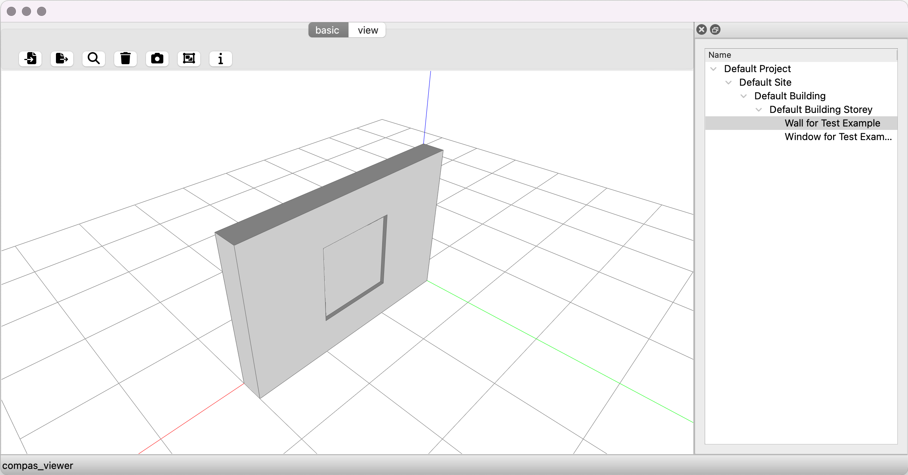
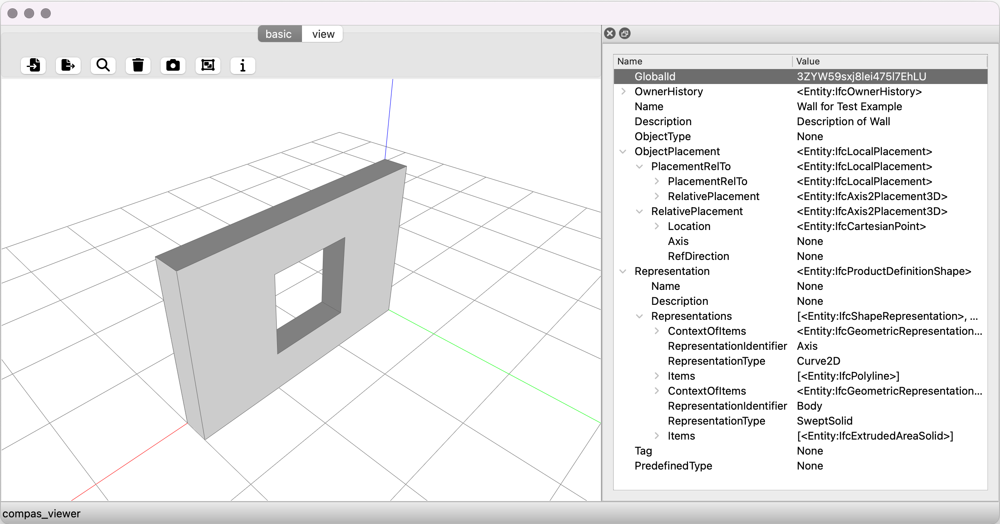

# Use COMPAS with IFC

Creating custom computational workflows for BIM can be challenging, because most commercial BIM applications are close-sourced and not designed to be extended. It is also not easy to perform data-exchange between BIM applications like Revit and CAD softwares such as Rhino or analysis tools like FEA softwares. COMPAS provides a set of tools for working with BIM data in a transparent and interoperable way through IFC format, allowing users to programatically extract information, perform analysis on, modify and create BIM models in a unified manner across multiple plaforms.

This tutorial will give an example of using COMPAS to interact and visualize BIM models in IFC format.

## Setup

Create a new conda environment called `bim` with `compas` and `compas_occ` installed.
```bash
conda create -n bim compas compas_occ
```

Activate the environment, and install `compas_ifc` and `compas_viewer`.
```bash
conda activate bim
pip install compas_ifc compas_viewer
```

## Load an IFC file

The first step is to load an IFC file into an IFC `Model` object.

```python
>>> from compas_ifc.model import Model
>>> model = Model("wall-with-opening-and-window.ifc")
>>> model.print_summary()
```
```
================================================================================
File: wall-with-opening-and-window.ifc
Size: 0.01 MB
Project: Default Project
Description: Description of Default Project
Number of sites: 1
Number of buildings: 1
Number of building elements: 2
================================================================================
```

Besides the summary, you can also print the spatial hierarchy of the IFC to see how the spatial elements are organized in this file.
```python
>>> model.print_spatial_hierarchy()
```
```
 <Project:IfcProject Name: Default Project, GlobalId: 28hypXUBvBefc20SI8kfA$>
---- <Site:IfcSite Name: Default Site, GlobalId: 1cwlDi_hLEvPsClAelBNnz>
-------- <Building:IfcBuilding Name: Default Building, GlobalId: 0AqAhXVxvCy9m0OX1nxY1A>
------------ <BuildingStorey:IfcBuildingStorey Name: Default Building Storey, GlobalId: 2GNgSHJ5j9BRUjqT$7tE8w>
---------------- <Window:IfcWindow Name: Window for Test Example, GlobalId: 0tA4DSHd50le6Ov9Yu0I9X>
---------------- <Wall:IfcWallStandardCase Name: Wall for Test Example, GlobalId: 3ZYW59sxj8lei475l7EhLU>
```

## Inspect entities in the IFC file

The `Model` object provides a set of methods to inspect the entities in the IFC file.
```python
>>> all_entities = model.get_all_entities()
>>> print("Total number of entities: ", len(all_entities))
```
```
Total number of entities:  133
```
```python
>>> spatial_elements = model.get_entities_by_type("IfcSpatialElement")
>>> print("Total number of spatial elements: ", len(spatial_elements))
```
```
Total number of spatial elements:  3
```

The most high-level spatial element of an IFC file is the `IfcProject` object, we provide a convenient way to access it by simply calling `model.project`.
```python
>>> project = model.project
>>> print(project.attributes)
```
```
{'GlobalId': '28hypXUBvBefc20SI8kfA$', 'OwnerHistory': <Entity:IfcOwnerHistory>, 'Name': 'Default Project', 'Description': 'Description of Default Project', 'ObjectType': None, 'LongName': None, 'Phase': None, 'RepresentationContexts': [<Entity:IfcGeometricRepresentationContext>], 'UnitsInContext': <Entity:IfcUnitAssignment>}
```

We can query any entities by calling `model.get_entities_by_type()`.
```python
>>> wall = model.get_entities_by_type("IfcWall")[0]
>>> print(wall.attributes)
```
```
{'GlobalId': '2GNgSHJ5j9BRUjqT$7tE8w', 'OwnerHistory': <Entity:IfcOwnerHistory>, 'Name': 'Default Building Storey', 'Description': 'Description of Default Building Storey', 'ObjectType': None, 'ObjectPlacement': <Entity:IfcLocalPlacement>, 'Representation': None, 'LongName': None, 'CompositionType': 'ELEMENT', 'Elevation': 0.0}
```

To get the same wall entity, we can also access it through the chain of spatial hierarchy.
```python
>>> wall = model.project.sites[0].buildings[0].building_storeys[0].walls[0]
>>> print(wall.attributes)
```
```
{'GlobalId': '2GNgSHJ5j9BRUjqT$7tE8w', 'OwnerHistory': <Entity:IfcOwnerHistory>, 'Name': 'Default Building Storey', 'Description': 'Description of Default Building Storey', 'ObjectType': None, 'ObjectPlacement': <Entity:IfcLocalPlacement>, 'Representation': None, 'LongName': None, 'CompositionType': 'ELEMENT', 'Elevation': 0.0}
```

Besides using the explict names, we can also traverse the spatial hierarchy by using the `parent` and `children` attributes of an spatial element.
```python
>>> building_storey = model.project.by_type("IfcBuildingStorey")[0]
>>> building_storey.parent
```
```
<Building:IfcBuilding Name: Default Building, GlobalId: 0AqAhXVxvCy9m0OX1nxY1A>
```
```python
>>> building_storey.children
```
```
[<Window:IfcWindow Name: Window for Test Example, GlobalId: 0tA4DSHd50le6Ov9Yu0I9X>, <Wall:IfcWallStandardCase Name: Wall for Test Example, GlobalId: 3ZYW59sxj8lei475l7EhLU>]
```


## Update and export to an IFC file

Besides retrieving the information out of and IFC file, you can update the attributes of an entity and save it to the save or a new IFC file.
```python
>>> model.project["Name"] = "New Project Name"
>>> model.project["Description"] = "New Project Description"
>>> model.save("project_name_changed.ifc")
```

You can also export a subset of entities to a new IFC file. While doing so, `compas_ifc` will automatically maintain the necessary spatial hierarchy for the exported entities.
```python
>>> window = model.get_entities_by_type("IfcWindow")[0]
>>> entities_to_export = [window]
>>> model.export(entities_to_export, "window.ifc")
>>> new_model = Model("window.ifc")
>>> new_model.print_spatial_hierarchy()
```
```
 <Project:IfcProject Name: Default Project, GlobalId: 28hypXUBvBefc20SI8kfA$>
---- <Site:IfcSite Name: Default Site, GlobalId: 1cwlDi_hLEvPsClAelBNnz>
-------- <Building:IfcBuilding Name: Default Building, GlobalId: 0AqAhXVxvCy9m0OX1nxY1A>
------------ <BuildingStorey:IfcBuildingStorey Name: Default Building Storey, GlobalId: 2GNgSHJ5j9BRUjqT$7tE8w>
---------------- <Window:IfcWindow Name: Window for Test Example, GlobalId: 0tA4DSHd50le6Ov9Yu0I9X>
```


Create a new IFC file from scratch

## Visualize the IFC file with COMPAS Viewer

With COMPAS Viewer, you can easily visualize the IFC file in a few lines of code.
```python
from compas_viewer import Viewer
from compas_ifc.model import Model

model = Model("data/wall-with-opening-and-window.ifc")

viewer = Viewer()

for entity in model.get_entities_by_type("IfcBuildingElement"):
    print("Converting to brep:", entity)
    print(entity.body_with_opening)
    viewer.add(entity.body_with_opening, name=entity.name)

viewer.show()
```


With the Tree data structure in COMPAS, you can also create a spatial tree from the IFC file and visualize it in COMPAS Viewer.
```python
from compas_viewer import Viewer
from compas_viewer.layout import Treeform
from compas_ifc.model import Model
from compas.datastructures import Tree, TreeNode

model = Model("data/wall-with-opening-and-window.ifc")


spatial_tree = Tree()
root = TreeNode(name="root")
spatial_tree.add(root)


def add_entity_to_tree(entity, parent_node):
    node = TreeNode(name=entity.name)
    parent_node.add(node)
    for child in entity.children:
        add_entity_to_tree(child, node)


add_entity_to_tree(model.project, root)

spatial_tree.print_hierarchy()


viewer = Viewer()

for entity in model.get_entities_by_type("IfcBuildingElement"):
    viewer.add(entity.body_with_opening, name=entity.name)

viewer.layout.sidedock.add_element(Treeform(spatial_tree, {"Name": ".name"}))

viewer.show()

```


Same technique can be used to visualize the attributes of the entities in the IFC file.
```python
from compas_viewer import Viewer
from compas_viewer.layout import Treeform
from compas_ifc.model import Model
from compas_ifc.entities import Entity
from compas.datastructures import Tree, TreeNode

model = Model("data/wall-with-opening-and-window.ifc")


wall = model.get_entities_by_type("IfcWall")[0]


attribute_tree = Tree()
root = TreeNode(name="root")
attribute_tree.add(root)

max_level = 5


def add_attribute_to_tree(entity, parent_node, level=0):
    if level > max_level:
        return

    for key in entity.attributes:
        node = TreeNode(name=key)
        value = entity.attributes[key]
        node.attributes["value"] = str(value)
        parent_node.add(node)

        if isinstance(value, (list, tuple)):
            if isinstance(value[0], Entity):
                for item in value:
                    add_attribute_to_tree(item, node, level=level + 1)
        elif isinstance(value, Entity):
            add_attribute_to_tree(value, node, level=level + 1)


add_attribute_to_tree(wall, root)

viewer = Viewer(width=800, height=600)
viewer.add(wall.body_with_opening, name=wall.name)
viewer.layout.sidedock.add_element(Treeform(attribute_tree, {"Name": ".name", "Value": ".attributes['value']"}))

viewer.show()

```



