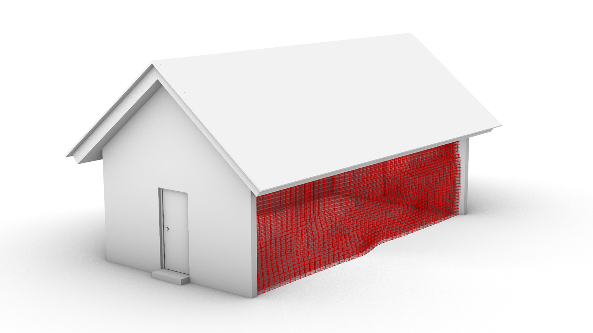

# COMPAS for Building Information Modelling

> **WARNING:** COMPAS IFC is currently being upgraded to support COMPAS 2.0.
> This upgrade is scheduled to be completed by the end of January 2024.
> Before the completion of upgrade, this tutorial serves as the INTENDED USAGE for COMPAS IFC with COMPAS 2.0.
> If you wish to use COMPAS IFC at its current state, please refer to the [COMPAS IFC documentation](https://compas.dev/compas_ifc).

Creating custom computational workflows for BIM can be challenging, because most commercial BIM applications are close-sourced and not designed to be extended. It is also not easy to perform data-exchange between BIM applications like Revit and CAD softwares such as Rhino or analysis tools like FEA softwares. COMPAS provides a set of tools for working with BIM data in a transparent and interoperable way through IFC format, allowing users to programatically extract information, perform analysis on, modify and create BIM models in a unified manner across multiple plaforms.

This tutorial will give an example of using COMPAS to load a BIM model of a simple house, replace its wall with a parametric one generated with Rhino Grasshopper and then export again as a valid IFC file.



## Setup

Create a new environment with BIM related packages in COMPAS ecosystem. `bim` is the name of the environment, `compas` is the COMPAS core library, `compas_ifc` is a package for interacting with IFC files, a widely used digital format for BIM applications, and `compas_viewer` is a package of COMPAS's stand-alone viewer.
```bash
conda create -n bim compas compas_ifc compas_viewer
```

Alternatively, you can create the environment from the provided `environment.yml` file.
```bash
conda env create -f environment.yml
```

Activate the environment and install COMPAS packages to Rhino.
```bash
conda activate bim
python -m compas_rhino.install -v 8.0
```

Open Python interperator and check the version of installed packages.
```bash
python
>>> import compas
>>> import compas_ifc
>>> import compas_viewer
>>> compas.__version__
'2.0.0'
>>> compas_ifc.__version__
'1.0.0'
>>> compas_viewer.__version__
'1.0.0'
```

## Open IFC file of existing BIM model with stand-alone viewer
IFC is a data-exchange format for BIM, it supported by most majority of BIM applications. We provide a [simple_house.ifc]() as the start point of this tutorial.

The `compas_ifc` package provides a stand-alone viewer. It can be used to conveniently inspect IFC file contents.

```
>>> from compas_ifc import IFCModel
>>> model = IFCModel.from_file('simple_house.ifc')
>>> model.summary()
...
```
Print the spatial hierrachy of the model.
```
>>> model.print_hierarchy()
...
```
Visualize the model in a viewer.
```
>>> model.show()
```
(IMAGE FOR VIEWER SHOWING THE INITIAL MODEL)

## Manipulate the BIM model with COMPAS in Rhino
Through COMPAS, the BIM model can also be loaded into Rhino, where it can be integrated with new components directly from COMPAS or native Rhino geometries.

Firstly, let's load the model and visualise it in Rhino by runnning this script:
```python
from compas.scene import Scene
from compas_ifc import IFCModel
scene = Scene()
model = IFCModel.from_file('simple_house.ifc')
scene.add(model)
scene.redraw()
```

(IMAGE SHOWING THE IFC MODEL IN RHINO)

The next step is preprocess the wall geometry in Rhino, to make it suitable as the input geometry of our parametric wall.
```
script to simplify the wall geometry.
```

(IMAGE OF SIMPLIFIED WALL GEOMETRY AS INPUT TO GRASSHOPPER SCRIPT)

Now it's time to run our [Grasshopper script]() to generate the parametric wall. We select the simplified wall geometry as the input to the Grasshopper script and bake the output.

(IMAGE PARAMETRIC WALL GENERATED BY GRASSHOPPER SCRIPT)

## Integrate custom geometry into the IFC model, with custom attributes
The next step is to integrate the parametric wall back into our BIM model. We can do this by using the `compas_ifc` package to read the parametric wall geometry from Rhino and then replace the existing wall geometry in the IFC model with the newly generated one.

```
script to read the parametric wall geometry from Rhino and insert it into the IFC model.
```

Additionally, we can also add attributes and custom properties to the parametric wall, such as the wall thickness, material information about our parametric bricks, etc. 
```
script adding attributes and properties to the parametric wall.
```


## Export the IFC model to a new IFC file
The final step is to export the modified IFC model to a new IFC file.
```
>>> model.save("simple_house_with_parametric_wall.ifc")
...
```

We can then open the new IFC file in the stand-alone viewer to examine the result.
```
>>> from compas_ifc import IFCModel
>>> model = IFCModel.from_file("simple_house_with_parametric_wall.ifc")
>>> model.show()
```

## Full automation
The whole process can be condensed into a single script, which can be run directly from the command line without any CAD software. See [scripts/full_script.py]()
