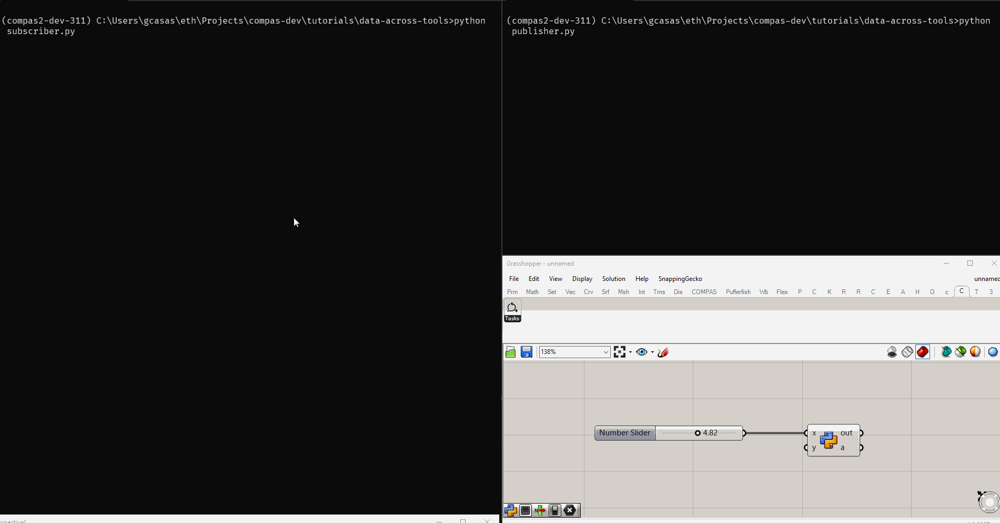

# Transfer data across tools

Sending and receiving data between different tools can be challenging. And sending data between different tools that are not even in the same computer even more!

This tutorial shows how to use `compas_eve` to achieve this very easily. We will create different "processes" that can send and receive data between each other, regardless of whether they are located in the same computer or not. Or the same country for that matter. As long as they have access to the internet, they can communicate.

## Setup

Create a new environment with COMPAS installed.
```bash
conda create -n compas-eve compas_eve -y
```

Activate the environment we just created.
```bash
conda activate compas-eve
```

## Hello World

This example shows a pattern of communication called publisher/subscriber. It allows to send messages from one process to many others with little to no coordination needed.

Messages are sent to a `topic`, which acts like a mailbox.

### First step: a subscriber

Let's start by creating a subscriber that listens to a topic and prints the messages it receives.

Create a python file called `subscriber.py` with the following content:

```python
import time

from compas_eve import Message
from compas_eve import Subscriber
from compas_eve import Topic
from compas_eve.mqtt import MqttTransport

topic = Topic("/compas_eve/hello_world/", Message)
tx = MqttTransport("broker.hivemq.com")

subcriber = Subscriber(topic, callback=lambda msg: print(f"Received message: {msg.text}"), transport=tx)
subcriber.subscribe()

print("Waiting for messages, press CTRL+C to cancel")
while True:
    time.sleep(1)
```

We can now start the subscriber by running:
```bash
python subscriber.py
```

We can leave this script running while we work on the next steps.

### Second step: a publisher

Now let's create a publisher that sends messages to the same topic.

Create a python file called `publisher.py` with the following content:

```python
import time

from compas_eve import Message
from compas_eve import Publisher
from compas_eve import Topic
from compas_eve.mqtt import MqttTransport

topic = Topic("/compas_eve/hello_world/", Message)
tx = MqttTransport("broker.hivemq.com")

publisher = Publisher(topic, transport=tx)

for i in range(100):
    msg = Message(text=f"Hello world #{i} from VS Code")
    print(f"Publishing message: {msg.text}")
    publisher.publish(msg)
    time.sleep(1)
```

Now we can start the publisher. Open a new terminal without closing the subscriber and run the following command:

```bash
python publisher.py
```

If you switch back to the subscriber terminal, you will see messages received counting up.

### Third step: grasshopper as a publisher

The last step of this example is to add another publisher but this time, from Grasshopper!

Add a new GH Python component and paste the following code:

```python
import time

from compas_eve import Message
from compas_eve import Publisher
from compas_eve import Topic
from compas_eve.mqtt import MqttTransport

topic = Topic("/compas_eve/hello_world/", Message)
tx = MqttTransport("broker.hivemq.com")

publisher = Publisher(topic, transport=tx)

msg = Message(text="Hello world from Grasshopper: #{}".format(x))
publisher.publish(msg)
```

Connect a slider to the `x` input.

Every time you move the slider, a new message will published. If you go back to your first terminal window, you will see the messages from Grasshopper coming in immediately!

## Conclusion

We've created a distributed system in which 3 scripts are able to communicate with each other with very little effort!



You can also try publishing messages to the same topic using a web browser and any of the MQTT online tools available.