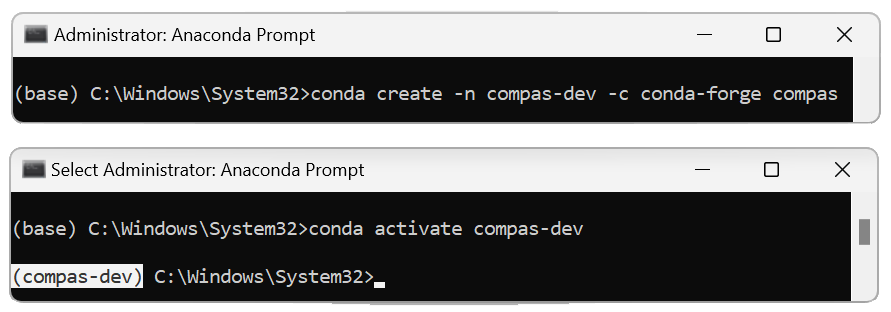
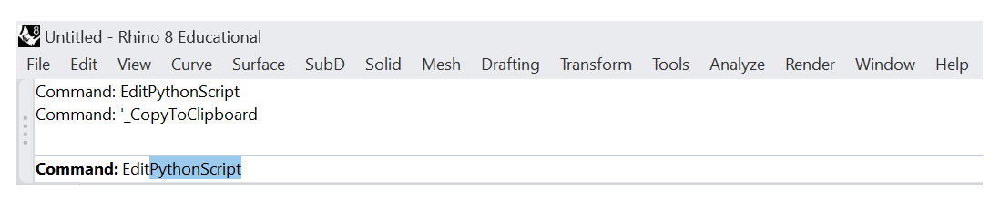
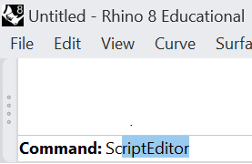
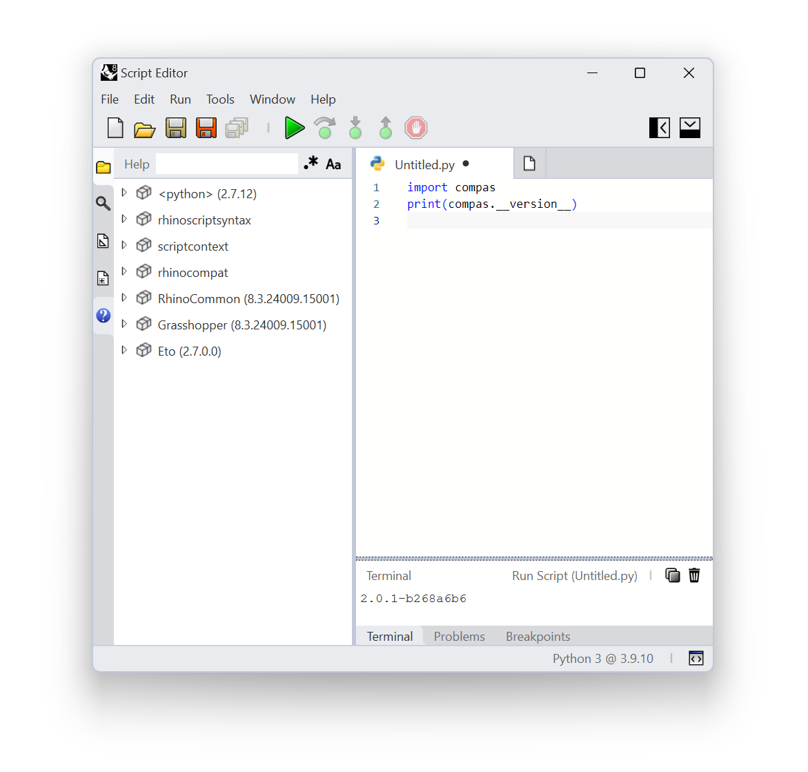

# Introduction

Rhino supports two editors: IronPython and CPython. The following tutorials explain how to install and use compas on both.

# Installation - Editor: IronPython

- **Step 1:** Install Anaconda: https://www.anaconda.com/products/distribution

- **Step 2:** Anaconda Prompt commands:
<br />
    ```bash

    conda create -n compas-dev -c conda-forge compas
    conda activate compas-dev
    python -m compas_rhino.install -v7.0
    ```

    

- **Step 3:** Open Rhino7 and in the command line type ```EditPythonScript```:
<br />
     

- **Step 4:** Use the following code to test, if compas is installed correctly:
<br />
    ```python
    import compas
    print(compas.__version__)
    ```

    

- **Notes:** If the latest compas version in development version is needed:
<br />
  -  a) clone or pull the latest compas from GitHub
  -  b) navigate to the compas folder
  -  c) install it via pip
  -  d) reference the folder in Rhino (on Windows, run Anaconda Prompt as administrator)
  -  e) if the symlinks are not working properly, delete all of them from the default location on Windows ```..\AppData\Roaming\McNeel\Rhinoceros\7.0\scripts``` or on Mac ```\Library\Application Support\McNeel\Rhinoceros\7.0\scripts```:
<br />

    ```bash
    conda activate compas-dev
    git clone https://github.com/compas-dev/compas.git
    cd compas
    pip install -e .
    python -m compas_rhino.install
    ```


# Installation - Editor: ScriptEditor


- **Step 1:** Install Anaconda: https://www.anaconda.com/products/distribution

- **Step 2:** Anaconda Prompt commands:
<br />
    ```bash
    conda create -n compas-dev -c conda-forge compas python=3.9
    conda activate compas-dev
    %USERPROFILE%/.rhinocode/py39-rh8/python.exe -m pip install -e .
    ```

- **Step 3:** Open Rhino8 ```ScriptEditor``` in the command line:
<br />
     

- **Step 4:** Use the following code to test, if compas is installed correctly:
<br />
    ```python
    import compas
    print(compas.__version__)
    ```

    

- **Notes:** If the latest compas version in development version is needed:
<br />
  -  a) clone or pull the latest compas from GitHub
  -  b) navigate to the compas folder
  -  c) install it via pip
  -  d) reference the folder in Rhino (on Windows, run Anaconda Prompt as administrator)
  -  e) if the symlinks are not working properly, delete all of them from the default location ```~/.rhinocode/py39-rh8/python3.9```:
<br />

    ```bash
    conda activate compas-dev
    git clone https://github.com/compas-dev/compas.git
    cd compas
    pip install -e .
    C:/Users/petrasv/.rhinocode/py39-rh8/python.exe -m pip install -e .
    ```
