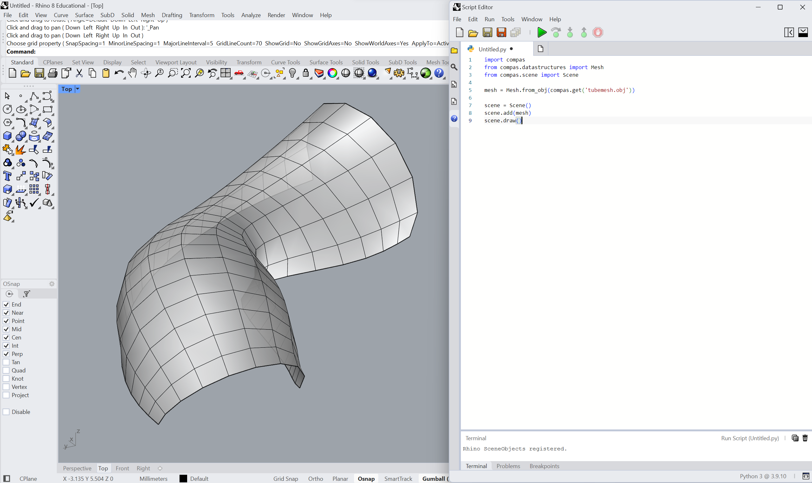

# Introduction

# Installation Rhino 7 IronPython Editor

- **Step 1:** Anaconda Prompt commands: a) create a new conda environment named e.g. *compas-dev*, or any other name, and install compas, b) activate the environment, and c) install compas_rhino for Rhino 7:

    ```bash
    conda create -n compas-dev -c conda-forge compas
    conda activate compas-dev
    python -m compas_rhino.install -v 7.0
    ```

    

- **Step 2:** Open Rhino 7 and in the command line type ```EditPythonScript```:

     

- **Step 3:** Use the following code to test, if compas is installed correctly:

    ```python
    import compas
    print(compas.__version__)
    ```

    


# Installation - Rhino 8 CPython Editor

- **Step 1:** Anaconda Prompt commands: a) create a new conda environment named e.g. *compas-dev*, or any other name, and install compas, b) activate the environment, and c) install compas_rhino for Rhino 8:

    ```bash
    conda create -n compas-dev -c conda-forge compas python=3.9
    conda activate compas-dev¨
    directory_of_rhinocode -m pip install compas
    ```

The *directory_of_rhinocode* of Rhino 8 CPython in Windows and Mac OS:
**WINDOWS** C:/Users/my_user_name/.rhinocode/py39-rh8/python.exe
**MAC** ~/.rhinocode/py39-rh8/python3.9

- **Step 2:** Open Rhino8 ```ScriptEditor``` in the command line:

     

- **Step 3:** Use the following code to test, if compas is installed correctly:

    ```python
    import compas
    print(compas.__version__)
    ```

    


## Load geometry

Load a mesh from a file and display it in Rhino.


```bash
import compas
from compas.datastructures import Mesh
from compas.scene import Scene

mesh = Mesh.from_obj(compas.get('tubemesh.obj'))

scene = Scene()
scene.add(mesh)
scene.draw()
```


