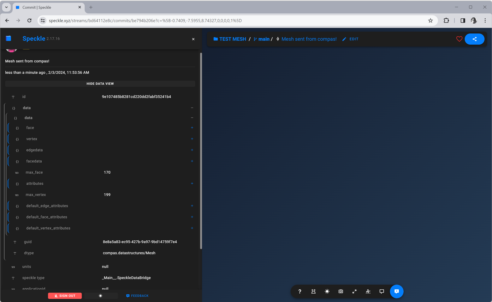
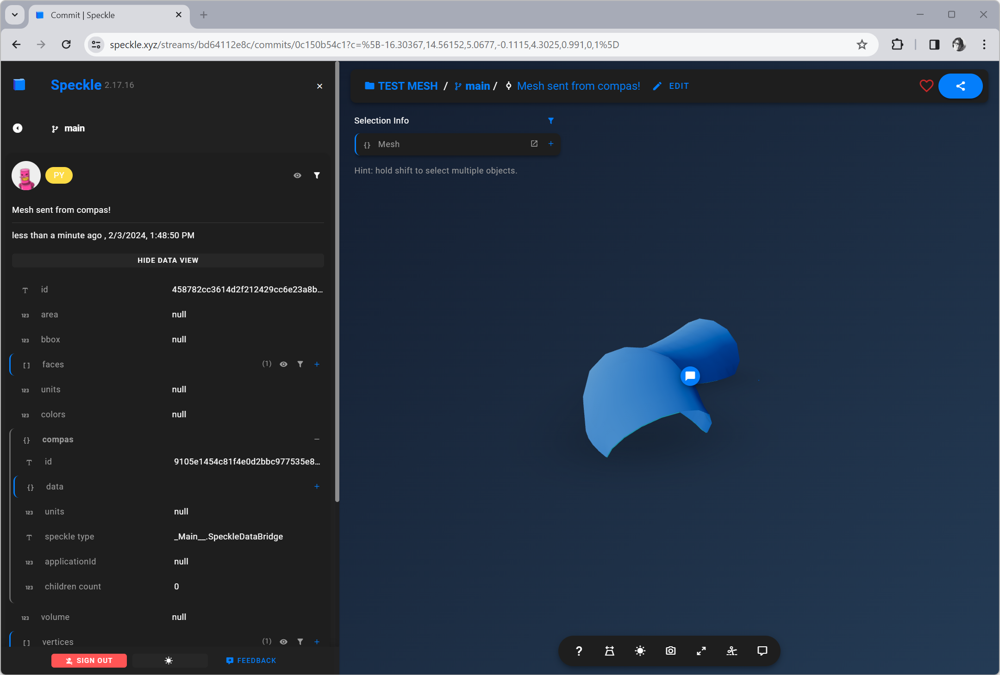

# Use COMPAS with Speckle

Speckle is a new generation of git-like version control system tailored for AEC. Using the Speckle Python API, we can easily send and receive COMPAS geometry and data to a Speckle server, using it as a data storage and sharing platform.

## Setup

Create a new conda environment called `compas-speckle` with `compas` installed.
```bash
conda create -n compas-speckle -c conda-forge compas
```

Activate the environment, and install `specklepy`.
```bash
conda activate compas-speckle
pip install specklepy
```

## Send and receive data

All COMPAS geometry and data can be converted to a JSON serialisable dict using the `DataEncoder` and `DataDecoder` classes. We can then use the `specklepy` API to send and receive the data to and from a Speckle server.

```python
from compas.data import DataDecoder
from compas.data import DataEncoder

from specklepy.objects import Base


class SpeckleDataBridge(Base):
    data: dict = {}

    @classmethod
    def from_compas(cls, compas_obj):
        encoder = DataEncoder()
        return cls(data=encoder.default(compas_obj))

    def to_compas(self):
        decoder = DataDecoder()
        return decoder.object_hook(self.data)


if __name__ == "__main__":

    import compas
    from compas.datastructures import Mesh

    from specklepy.api import operations
    from specklepy.api.client import SpeckleClient
    from specklepy.transports.server import ServerTransport

    mesh = Mesh.from_obj(compas.get("tubemesh.obj"))
    print(mesh)
    smesh = SpeckleDataBridge.from_compas(mesh)

    client = SpeckleClient(host="speckle.xyz")
    client.authenticate_with_token(token="__YOUR_TOKEN__")

    # commit the object data to the server
    stream_id = "__YOUR_STREAM__"
    transport = ServerTransport(client=client, stream_id=stream_id)
    object_id = operations.send(base=smesh, transports=[transport])
    commid_id = client.commit.create(
        stream_id=stream_id, object_id=object_id, message="Mesh sent from compas!"
    )

    # read the object back
    transport = ServerTransport(client=client, stream_id=stream_id)
    smesh = operations.receive(object_id, transport)
    mesh_received = smesh.to_compas()
    print(mesh_received)

```



## Display a Mesh in Speckle Web Viewer

In order to display a COMPAS data structrue such as a `Mesh` in the Speckle web viewer, we need to convert the mesh to its counterpart in Speckle, which is structured as a list of vertices and a list of faces that start with the number of vertices in the face. After the conversion, we can then nest our custom COMPAS object in the `Mesh` object of speckle.

```python
from compas.data import DataDecoder
from compas.data import DataEncoder

from specklepy.objects import Base


class SpeckleDataBridge(Base):
    data: dict = {}

    @classmethod
    def from_compas(cls, compas_obj):
        encoder = DataEncoder()
        return cls(data=encoder.default(compas_obj))

    def to_compas(self):
        decoder = DataDecoder()
        return decoder.object_hook(self.data)


if __name__ == '__main__':

    import compas
    from compas.datastructures import Mesh
    from compas.utilities import flatten

    from specklepy.objects.geometry import Mesh as SMesh
    from specklepy.api import operations
    from specklepy.api.client import SpeckleClient
    from specklepy.transports.server import ServerTransport

    mesh = Mesh.from_obj(compas.get('tubemesh.obj'))
    print(mesh)

    def mesh_to_vertices_and_faces(mesh: Mesh):
        vertices, faces = mesh.to_vertices_and_faces()
        triangles = []
        for face in faces:
            triangles.append([len(face), *face])
        return list(flatten(vertices)), list(flatten(triangles))

    vertices, faces = mesh_to_vertices_and_faces(mesh)
    smesh = SMesh(vertices=vertices, faces=faces)
    smesh["compas"] = SpeckleDataBridge.from_compas(mesh)

    client = SpeckleClient(host="speckle.xyz")
    client.authenticate_with_token(token="__YOUR_TOKEN__")

    # commit the object data to the server
    stream_id = '__YOUR_STREAM__'
    transport = ServerTransport(client=client, stream_id=stream_id)
    object_id = operations.send(base=smesh, transports=[transport])
    commid_id = client.commit.create(stream_id=stream_id, object_id=object_id, message='Mesh sent from compas!')


    # read the object back
    transport = ServerTransport(client=client, stream_id=stream_id)
    smesh = operations.receive(object_id, transport)
    mesh_received = smesh["compas"].to_compas()
    print(mesh_received)

```

